<!--
_paginate: false
_class: cover
-->

# Python on OpenSearch

### Bringing Native Python Scripting to Search and Analytics

<br>

**Shen Yuanchun & Li Shuang**
OpenSearchCon China 2026

<!--
Good morning everyone. I'm Yuanchun, and this is my colleague Li Shuang. We're both machine learning engineers on the Shanghai OpenSearch team.

Today we want to talk about something we've been building — running Python natively inside OpenSearch. We'll show you why we think it's needed, how it works under the hood, and where we think it can go from here.

But first, a quick intro of our team.
-->

---

# About Us

- **Shen Yuanchun** & **Li Shuang** — Machine Learning Engineers, Shanghai OpenSearch Team
- Our team builds both software and machine learning solutions on OpenSearch
- Contributors: Yuanchun, Shuang, and many from the Shanghai OpenSearch team

<!--
Our team builds both software and machine learning solutions on OpenSearch. This project is a collaboration between we two and many others from the Shanghai team. Now let's jump into the problem we're trying to solve.
-->

---

# Painless Is... Painful

OpenSearch scripting today means **Painless** — but in practice:

- **Restrictive** — Java-like but not Java; strict allowlist blocks common operations
- **Hard to debug** — cryptic errors, no REPL, no breakpoints
- **Under-documented** — limited docs and examples
- **No ecosystem** — cannot import libraries or call external services

<!--
If you've written custom scripts in OpenSearch, you've probably used Painless. It's the default scripting language, designed to be safe and fast.

But in practice, Painless is painful. It looks like Java, but it's not Java — it's a restricted subset with a strict allowlist of methods. Common operations you'd expect, like String.split or regex, are either missing or require cluster-level settings to enable. The syntax has subtle differences from Java, so your existing knowledge only partially transfers.

Debugging is frustrating — error messages are vague and cryptic, and there's no REPL, no breakpoints, no way to print a variable. The documentation is sparse, with limited examples, so most developers resort to trial and error.

And there's no ecosystem at all. No imports, no libraries, no HTTP calls. If the allowlist doesn't have what you need, you're stuck.
-->

---

# What if You Could Just Use Python?

<div class="columns">
<div class="col">

**Painless — extract error code**
```java
String msg = doc['message.keyword'].value;
int idx = msg.indexOf('error_code=');
if (idx == -1) { return 'N/A'; }
int end = msg.indexOf(',', idx);
if (end == -1) { end = msg.length(); }
return msg.substring(idx + 11, end);
```

</div>
<div class="col">

**Python — extract error code**
```python
import re
msg = doc['message.keyword'][0]
match = re.search(
    r'error_code=(E\d+)', msg)
match.group(1) if match else 'N/A'
```

</div>
</div>

<br>

Python: familiar syntax, real regex, standard library, third-party packages.

<!--
So we asked ourselves — what if we could just use Python?

Look at this comparison. We want to extract an error code from a log message. In Painless, you're doing indexOf, substring, manual bounds checking — six lines of fragile string manipulation. In Python, it's a two-line regex. Import re, search for the pattern, done.

And this is just the beginning. Python gives you the standard library — json, re, collections, math — plus third-party packages like NumPy. And the syntax is what most developers already write every day. No context switch, no new language to learn.
-->

---

# What We Built

A **Python Language Plugin** for OpenSearch

- Script contexts (where and how a script runs) supported so far: **ingest**, **search**, **scoring**, **field**
- Use Python standard library: `math`, `json`, `re`, `collections`, ...
- Import third-party libraries like **NumPy**

<br>

Let me show you.

<!--
So we built a Python Language Plugin for OpenSearch. Anywhere you'd normally write a Painless script, you can now write Python instead — during indexing, search, scoring, script fields, and more.

And you get the full Python standard library — math, json, re, collections — all built in. We've also bundled NumPy as a proof of concept for third-party libraries.

Alright, enough talking. Let my colleague Li Shuang show you how it works in action.
-->

---

# Demo 1: Log Analysis with Python stdlib

**Scenario**: Extract IPs, error codes, and parse embedded JSON from application logs

**Case 1** — `re`: extract IPs and error codes from error logs

```python
import re
msg = doc['message.keyword'][0]
re.findall(r'\d{1,3}\.\d{1,3}\.\d{1,3}\.\d{1,3}', msg)
```

**Case 2** — `json`: parse embedded JSON in log messages

```python
import json
data = json.loads(doc['message.keyword'][0])
f"{data['service']} v{data['version']} - {data['status']}"
```

<!--
[Shuang runs the log analysis demo on terminal]

Let's start with a real-world scenario — log analysis. We have an index of application logs: error messages with IPs and error codes, info messages, and even structured JSON embedded in text fields.

First, Shuang extracts IP addresses and error codes from error logs using Python's re module. One regex, one line — re.findall pulls out all IPs, re.search grabs the error code. Try doing that in Painless without even having String.split available.

Then for the deploy log, we parse embedded JSON directly. json.loads, access the fields, format a string. In Painless, parsing JSON inside a text field is essentially impossible — there's no JSON parser in the whitelist. In Python, it's three lines.
-->

---

# Demo 2: E-Commerce Ranking with NumPy

**Scenario**: Rank products by customer ratings — naive average vs confidence-weighted

**Part 1** — Naive average scoring:

```python
ratings = doc['ratings']
sum(ratings) / len(ratings)
```

**Part 2** — Confidence-weighted scoring with NumPy:

```python
import numpy as np
arr = np.array(doc['ratings'], dtype=float)
mean, std, count = np.mean(arr), np.std(arr), len(arr)
# Higher mean + lower variance + more ratings = better
float(mean * (1 - std / 5) * np.log2(count + 1))
```

<!--
[Shuang sets up the products index with 5 products and runs Part 1]

Now let's look at a real e-commerce scenario. We have a products index — headphones and earbuds, each with customer ratings.

First, naive scoring — just average the ratings. One line of Python. The Budget Earbuds and Premium Headphones both score 5.0 because they have perfect ratings. But one has a single rating and the other has five — should we really trust them equally?

[Shuang runs Part 2 — NumPy scoring]

So here's a smarter approach using NumPy. We compute a confidence-weighted score: np.mean for the average, np.std to penalize inconsistency, and np.log2 of the count to reward products with more reviews.
-->

---

# Demo 2: Results — Naive vs Confidence-Weighted

| Product | Ratings | Naive Avg | NumPy Score |
|---------|---------|-----------|-------------|
| Premium Over-Ear | [5,5,5,5,5] | **5.0** | 12.93 |
| Wireless NC | [5,4,5,4,5,4,5] | 4.57 | **13.13** |
| Budget Earbuds | [5] | **5.0** | 5.0 |
| Sports Earphones | [3,3,3,3,3] | 3.0 | 7.75 |
| Studio Monitor | [4,3,5,2,1,5] | 3.33 | 5.75 |

**Wireless NC Headphones** jumps to #1 — 7 consistent ratings outweigh a perfect but small sample.

<!--
And look at the results. The Wireless Noise-Canceling Headphones jump to number one — they have seven ratings with good consistency, so the confidence formula rewards them over the Premium Over-Ear's five perfect ratings. Meanwhile the Budget Earbuds drop — a single five-star rating simply isn't enough confidence.

This is the kind of ranking logic that would take dozens of lines in Painless — manual loops for mean and standard deviation, no built-in log function. With NumPy, it's readable and concise. You could also do cosine similarity, percentile calculations, outlier detection — things that are natural in NumPy but impractical in Painless.
-->

---

# Demo 3: AI-Augmented Support Tickets

**Scenario**: Auto-generate support replies for open tickets using OpenAI

```python
import json, os, urllib.request

title = doc['title.keyword'][0]
desc = doc['description.keyword'][0]
prompt = f"Customer ticket: {title}\nDetails: {desc}\n"
        + "Write a brief, helpful support reply."

body = json.dumps({
    'model': 'gpt-4o-mini',
    'messages': [
        {'role': 'system', 'content': 'You are a helpful customer '
         + 'support agent. Reply in 2-3 sentences.'},
        {'role': 'user', 'content': prompt}],
    'max_tokens': 100, 'temperature': 0}).encode()

req = urllib.request.Request(
    'https://api.openai.com/v1/chat/completions', data=body,
    headers={'Content-Type': 'application/json',
             'Authorization': 'Bearer ' + os.environ['OPENAI_API_KEY']})
result = json.loads(urllib.request.urlopen(req).read())
result['choices'][0]['message']['content']
```

<!--
[Shuang runs the support ticket demo on terminal]

Now here's where it gets really interesting. We have an index of support tickets — password resets, billing issues, feature requests — each with a title, description, and priority.

Shuang is running a search query with a Python script field. For each open ticket, the script reads the title and description, calls OpenAI's chat completion API using urllib.request, and returns a suggested reply — all at query time.

The API key comes from an environment variable, so it's never stored in OpenSearch. The script is pure Python standard library — json, os, and urllib.request. No SDK, no extra dependencies.

[Shuang shows the results with AI-generated replies]

And there we go — each ticket now has a suggested reply. "Cannot reset my password" gets a helpful troubleshooting response. "Billing charged twice" gets an apology with a refund promise. This pattern works for any external API — summarization, classification, translation, sentiment analysis. In Painless, you simply can't make an HTTP call. In Python, it's natural.
-->

---

# How It Works


Python runs **inside the JVM** via GraalVM — no subprocess, no network call.

<!--
OK so you've seen what it does — let me explain how it works.

When a Python script comes in, it goes through three stages. First, we parse it with Python AST written in ANTLR 4 — this catches syntax errors early. Then our semantic analyzer runs — this is a safety check, mainly looking for infinite loops. And finally, the script runs inside a GraalVM polyglot context.

The key point is: Python runs inside the JVM. There's no external process, no network call to a Python runtime, no serialization overhead for passing data back and forth.
-->

---

# GraalVM: The Key Enabler

**GraalVM Polyglot** allows multiple languages to coexist on the JVM.



- **GraalPy** interprets Python inside the JVM — no subprocess, no sidecar
- Java objects passed directly to Python as **bindings**

<!--
GraalVM is what makes this possible. Its polyglot API lets you embed multiple language runtimes in the same JVM process.

As you can see in the diagram, the GraalPy context lives inside the JVM, right alongside OpenSearch. Document fields, query parameters, and ingest context are passed directly into the Python runtime as bindings — no serialization, no copying. The script runs, and the result comes back out the same way.

GraalPy is GraalVM's Python implementation, so the full language and standard library are available.
-->

---

# Safety: What Could Go Wrong?

| Threat | Mitigation |
|--------|------------|
| **Infinite loops** | Static analyzer catches `while True`; hard timeout kills the rest |
| **Resource abuse** | Memory caps available; fresh GraalVM context per call, disposed after |
| **Data leakage** | Context isolation — scripts only see bindings passed in, no cross-execution state |

- GraalVM **sandbox policies** range from `TRUSTED` to `UNTRUSTED` — controlling host I/O, native access, and resource limits. We use TRUSTED for now.

<!--
Running user code inside your search engine — that raises some obvious questions.

What if someone writes an infinite loop? A static analyzer catches obvious patterns like while True with no break. For trickier cases that slip past static analysis, there's a hard timeout — if a script doesn't finish, it gets killed.
What if a script consumes too many resources? GraalVM also supports per-context limits like statement caps and memory-constrained sandboxing. Each script gets a fresh GraalVM context that's disposed right after — nothing accumulates.
What if it tries to steal your credentials? The script only sees the bindings explicitly passed in — like document fields and query parameters — and there's no shared state between executions.

GraalVM provides built-in sandboxing, it establishes a security boundary between host and guest code. Policies range from TRUSTED to UNTRUSTED, progressively restricting file system, network, and native access. We use TRUSTED today for NumPy compatibility, with stricter policies on the roadmap.
-->

---

# Supported Script Contexts

| Context | Variables | Use Case |
|---------|-----------|----------|
| **Ingest** | `ctx`, `params` | Document transformation during indexing |
| **Search** | `ctx`, `params` | Dynamic search request modification |
| **Score** | `doc`, `params`, `_score` | Custom ranking and relevance tuning |
| **Field** | `doc`, `params` | Computed fields at query time |
| **Template** | `params` | Script testing via execute API |

<br>

Each context exposes exactly the data the script needs — nothing more.

<!--
You've now seen Python used in scoring and script fields in the demos. But it works in more places. You can use it during indexing to transform documents, during search to modify queries, in scoring to customize ranking, and in script fields to compute values at query time.

These are what OpenSearch calls "script contexts" — they define where a script runs and what data it can access. We support four so far, with more on the way. And as you can see in the table, each context exposes exactly the variables the script needs — nothing more.
-->

---

# Challenges

### Security
- Only `TRUSTED` sandbox available for GraalVM community edition
- Appropriate for **controlled environments** today

### Library Support
- Python stdlib: fully available
- NumPy: bundled, working
- Other packages: requires plugin rebuild to add

### Performance
- Next slide

<!--
Let me be honest about the challenges.

Security — we currently use a trusted sandbox policy. That's needed because libraries like NumPy use native C extensions. Also, this is the only policy that's available in graalvm community edition. This means the plugin is appropriate for controlled environments for now

Library support — the full standard library works. NumPy is bundled. But adding other packages currently requires rebuilding the plugin.

Now let's talk about performance. This deserves a deeper look.
-->

---

# Performance: Benchmarks

| Scenario | Painless | Python | Ratio |
|----------|----------|--------|-------|
| Arithmetic (sum 1..100) | 4.0 ms | 8.5 ms | 2.1x |
| String reverse | 3.9 ms | 5.6 ms | 1.4x |
| Fibonacci(20) | 3.5 ms | 6.0 ms | 1.7x |
| Array sort + sum (50 elem) | 2.8 ms | 5.2 ms | 1.9x |

- Averaged over 10 executions; no document access
- **1.4–2.1x** overhead — reasonable for the capabilities gained

<!--
Here are some benchmark numbers. Python is about 1.4 to 2.1x slower than Painless for pure computation. The gap is not 10x or 100x — it's manageable. And for anything involving regex, JSON parsing, NumPy, or HTTP calls, Python gives you capabilities that Painless simply doesn't have.

But why is it slower? Let's look at what's happening under the hood.
-->

---

# Why Slower? How to Fix It?

**Painless** compiles to JVM bytecode directly — optimized from the start.
**GraalPy** interprets via AST walking; JIT needs 400+ calls to kick in — short-lived scripts never reach it.

Creating a fresh GraalVM context per execution brings overhead

- **Engine sharing** — reuse compiled code across contexts
- **Context pooling** — pre-warm contexts, skip initialization overhead
- **Source caching** — cache parsed ASTs for repeated scripts

<!--
So where's the gap from? Painless compiles directly to JVM bytecode with ASM — optimized from the start. GraalPy interprets via AST walking, and its JIT needs hundreds of invocations to kick in, so short-lived scripts will never reach it. On top of that, creating fresh contexts per execution also cause overhead. In the future, we will keep optimizing the performance via engine sharing, context pooling, and source caching.
-->

---

# Roadmap

- **Performance**: optimizing with possibly engine sharing, context pooling, source caching
- **Security enhancement**: configurable security policies per use case
- **More script contexts**: aggregation, similarity, and more
- **Community feedback**: what features matter most to you?

<!--
Looking ahead — performance optimization is our top priority. We'd also like to enhace security and offer configurable security options so users can choose their tradeoff. We also want to support more script contexts like aggregation and similarity, 

But most importantly, we want to hear from you. What would you use this for? That feedback will shape where this goes next.
-->

---

# Try It

**GitHub**: github.com/yuancu/lang-python

```bash
# Build
./gradlew build

# Install
opensearch-plugin install file:///path/to/lang-python-3.4.0.0.zip

# Run your first Python script
POST /_scripts/python/_execute
{ "script": { "source": "'Hello, OpenSearchCon!'" } }
```

<br>

Issues, PRs, and feedback welcome.

<!--
The plugin is open source on GitHub. You can build it with Gradle, install it like any OpenSearch plugin, and run your first Python script in about two minutes.

We'd love for you to try it out, file issues, tell us what works and what doesn't.
-->

---

<!--
_paginate: false
_class: end
-->

# Thank You

**Shen Yuanchun & Li Shuang**

GitHub: github.com/yuancu/lang-python
OpenSearch Issue: #17432

Questions?

 Scan to leave feedback

<!--
That's it from us. Thank you for listening. We're happy to take questions.

[Q&A: 5 minutes. Yuanchun takes architecture/design questions, Shuang handles demo/usage questions.]
-->
